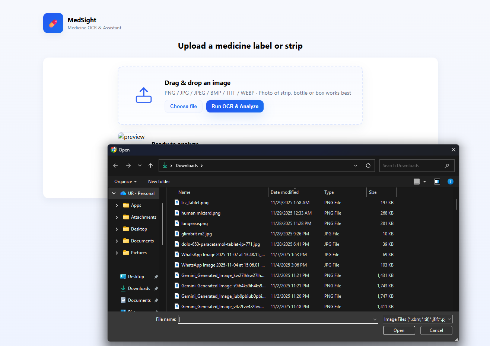
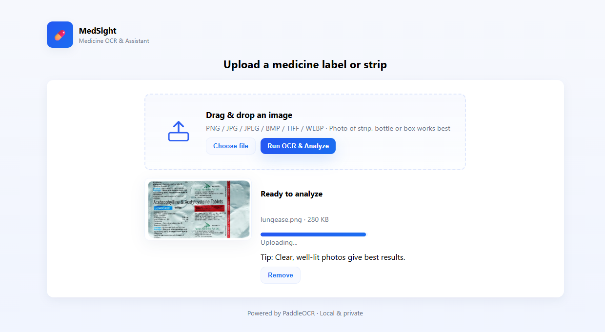
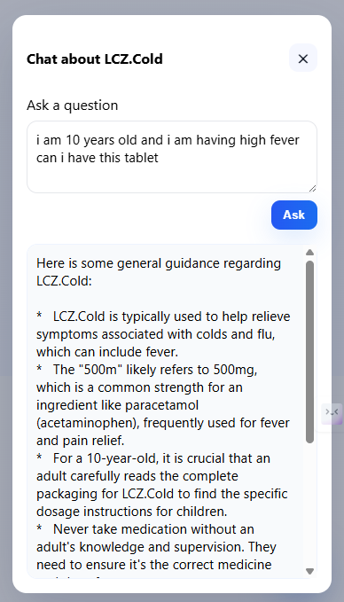
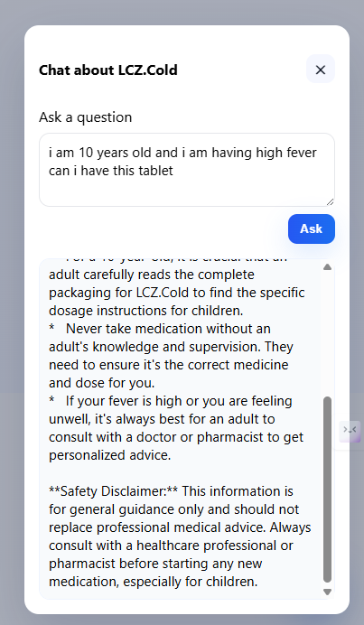

# MediLens – Medicine OCR & Assistant 💊📷

MediLens is a web-based application that extracts text from medicine labels or strips using **PaddleOCR** and suggests possible medicine names.  
The application works **offline for OCR**, with **optional Gemini AI integration** for enhanced medicine understanding.

---

## 📌 Project Overview

- Upload a medicine strip, bottle, or box image
- Extract text using OCR
- Detect possible medicine names
- Optionally use Gemini AI for advanced analysis
- Clean and simple web interface

---

## 🚀 Features

### 1️⃣ Image Upload
- Upload medicine images via file picker
- Supported formats:
  - PNG
  - JPG / JPEG
  - BMP
  - TIFF
  - WEBP
- Image preview before processing

📸 **Upload Interface**
  

---

### 2️⃣ OCR (Optical Character Recognition)
- Uses **PaddleOCR (offline, local processing)**
- Multi-language OCR support
- Extracts raw text from medicine labels
- Handles noisy and nested OCR outputs safely

📸 **OCR Processing Screen**
  

---

### 3️⃣ Medicine Name Detection
- **Local candidate extraction**
  - Uses n-grams (1–5 words)
  - Removes noise, symbols, and stopwords
- **Optional Gemini AI-based analysis**
  - Reads OCR text
  - Suggests medicine names and explanations
  - Activated only if API key is provided

📸 **OCR Result – Candidate Detection**
  

---

### 4️⃣ Chatbot Assistant (Optional)
- AI assistant interface for medicine-related queries
- Uses Gemini API if enabled
- Works as a conversational assistant

📸 **Chatbot Interface**
  

---

## 🔐 Setting Up API Key (Optional – Gemini AI)

### Step 1: Create `.env` file
Create a file named `.env` in the **project root directory**:

### Step 2: Add Gemini API Key
Inside `.env` file:

---

## How to run the project

Step 1: python -m venv venv

Step 2 : venv\Scripts\activate

Step 3 : pip install -r requirements.txt

Step 4 : python app.py

Step 5 : Open your browswer with this IP "http://127.0.0.1:5000"

---
 

